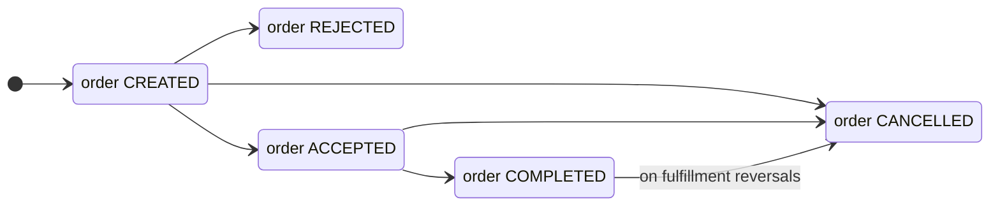
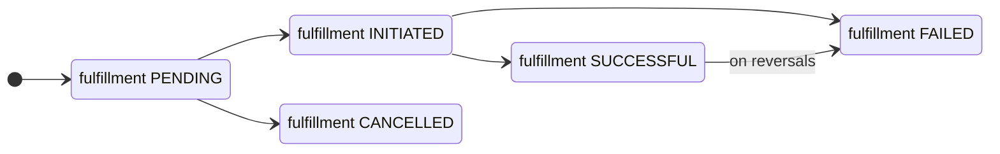
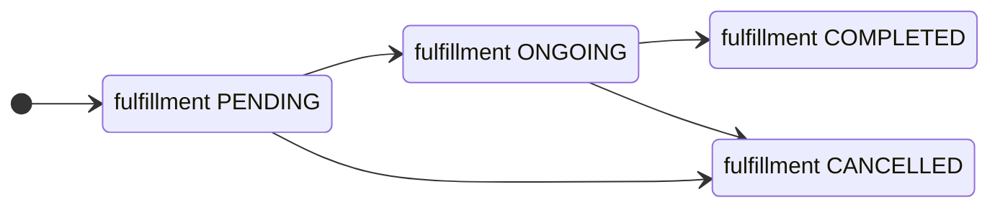

## Order

### States

- `CREATED`: Draft order.
- `ACCEPTED`: Order is accepted by BPP. This means all validations are done and the buyer app can facilitate payment
- `REJECTED`: Order is rejected by BPP. This means some validations have failed and the order cannot be accepted. As most validations are done before creating the order during init phase, it is rare for an order to get rejected
- `CANCELLED`: Order is cancelled either by BAP or BPP. This means for sip order, no more instalments will be generated
- `COMPLETED`: Order is completed successfully. In case of an sip order, it means all instalments are completed. In case of a lumpsum/redemption/sip_instalment order, it means order is processed successfully

#### Order States Flow

## Fulfillment

Fulfillment is the order processing activity, which happens after the order is accepted.

### Types

- `LUMPSUM`
- `SIP`
- `REDEMPTION`
- `SIP_INSTALMENT`

### States

- `PENDING`: In case of purchases, fulfillment starts only after payment is done. This state indicates that the order is confirmed, but the payment is pending.
- `INITIATED`: This means the fulfillment is started. In case of one time orders - the orders are sent for processing. Not applicable for recurring orders.
- `ONGOING`: For recurring orders (sip, swp), this means the instalments are ongoing as per the schedule. Applicable only for recurring orders.
- `COMPLETED`: For recurring orders (sip, swp), this means the instalments are completed as per the schedule and no new instalments will be generated. Applicable only for recurring orders.
- `CANCELLED`: For recurring orders (sip, swp), this means the order is cancelled by the seller app and no new instalments will be generated.
- `SUCCESSFUL`: Order is successfully processed. For purchase orders, this means units have been allotted.
- `FAILED`: Order is not processed. Typically failed by the AMC/RTA due to invalid kyc/bank-account among other reasons.

#### Fulfillment States Flow (Onetime Orders)

#### Fulfillment States Flow (Recurring Orders)

- On fulfillment failure, order moves to cancelled state
- On fulfillment success/completion, order moves to completed state
- On fulfillment cancellation, order moves to cancelled state

## Payment

### Types

- `PRE_FULFILLMENT`

### Payment methods

If no payment method is present, `url` in payment params contains a generic redirect url. If it is present, following are the different combinations possible.

- mode: `NETBANKING`  
one time payment through bank redirect. uri in the payment params contains the redirect url
- mode: `UPI`, auth: `URI`  
upi payment through intent/qrcode. `url` in payment params contains the upi uri
- mode: `UPI`, auth: `COLLECT`  
upi payment through collect request. `source_virtual_payment_address` in payment params contains the consumer's upi handle on which the collect request is sent.
- mode: `UPI_AUTOPAY`, auth: `URI`  
upi mandate registration through intent/qrcode. `url` in payment params contains the upi uri
- mode: `UPI_AUTOPAY`, auth: `COLLECT`  
upi mandate registration through collect request. `source_virtual_payment_address` in payment params contains the consumer's upi handle on which the collect request is sent.
- mode: `UPI_AUTOPAY`, auth: `EXISTING_MANDATE`  
use existing upi autopay mandate for the payment (both onetime and recurring). other tags capture the details of the mandate - `MANDATE_IDENTIFIER`, `MASKED_BANK_ACCOUNT_NUMBER`, `BANK_ACCOUNT_NAME`, `BANK_NAME`  
- mode: `NACH`, auth: `NETBANKING`  
nach mandate registration using netbanking credentials. `url` in payment params contains the redirect url
- mode: `NACH`, auth: `DEBIT_CARD`  
nach mandate registration using debit card. `url` in payment params contains the redirect url
- mode: `NACH`, auth: `AADHAAR`  
nach mandate registration using aadhaar number. `url` in payment params contains the redirect url
- mode: `NACH`, auth: `EXISTING_MANDATE`  
use existing nach mandate for the payment (both onetime and recurring). other tags capture the details of the mandate - `MANDATE_IDENTIFIER`, `MASKED_BANK_ACCOUNT_NUMBER`, `BANK_ACCOUNT_NAME`, `BANK_NAME`  
<!-- - mode: `NEFT`  
offline bank transfer through NEFT. `bank_account_number` and `bank_code` contains BPP's bank a/c details for transfer.
- mode: `RTGS`  
offline bank transfer through RTGS. `bank_account_number` and `bank_code` contains BPP's bank a/c details for transfer.
- mode: `IMPS`  
offline bank transfer through IMPS. `bank_account_number` and `bank_code` contains BPP's bank a/c details for transfer.
- mode: `CHEQUE`
offline bank transfer through cheque. TODO -->

### States

- `PAID`: Payment is successfully collected
- `NOT_PAID`: Payment is pending
- `FAILED`: Payment failed either due to incorrect user action or system issues
